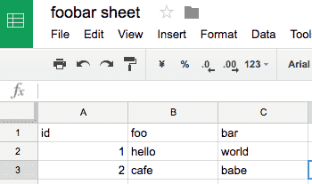

# middleman-spreadsheet

Middleman extension for using Google spreadsheet as data files. Edit

## Installation

Add this line to your application's Gemfile:

```ruby
gem 'middleman-spreadsheet'
```

And then execute:
```
$ bundle
```

## Setup

1. Go to [Google API Console](https://console.developers.google.com/apis/credentials) and creates your own API credentials.
2. Create google credentials json like
```
{
 "client_id": "xxxxxxxxxxxx-xxxxxxxxxxxxxxxxxxxxxxxxxxxxxxxx.apps.googleusercontent.com",
 "client_secret": "xxxxxxxxxxxxxxxxxxxxxxxx"
}
```
3. Activate `:spreadsheet` like below.
```ruby
activate :spreadsheet do |spreadsheet|
  spreadsheet.config = "google_credentials.json"
  spreadsheet.spreadsheet_url = "https://docs.google.com/spreadsheets/d/xxxxxxxxxxxxxxxxxxxxx/edit#gid=0"
end
```

If you want to manage credentials without json, you could to use `spreadsheet.credentials` option.

## Usage
### Create spreadsheet
Create spreadsheet.



### Specify spreadsheet
You can specify spreadsheet by `spreadsheet_url`

```ruby
spreadsheet.spreadsheet_url = "https://docs.google.com/spreadsheets/d/xxxxxxxxxxxxxxxxxxxxx/edit#gid=0"
```

or `spreadsheet_key`

```ruby
spreadsheet.spreadsheet_key = "xxxxxxxxxxxxxxxxxxxxx"
```
 or `spreadsheet_title`.

```ruby
spreadsheet.spreadsheet_title = "foo bar sheet"
```


### Use in template
You can use `data.spreadsheet.<worksheet_title>` like below.

```haml
%ul
  - data.spreadsheet.Sheet1.each do |item|
    %li #{item.id} #{item.foo} #{item.foo}
```

### Use in `config.rb`
You can use `app.data.spreadsheet.<worksheet_title>` like below.

```ruby
app.data.spreadsheet.Sheet1.each do |row|
  proxy "/foo/#{row.id}.html", "/items/show.html", locals: { foo: row }
end
```

## Contributing

Bug reports and pull requests are welcome on GitHub at https://github.com/hogelog/middlmean-spreadsheet.


## License

The gem is available as open source under the terms of the [MIT License](http://opensource.org/licenses/MIT).
